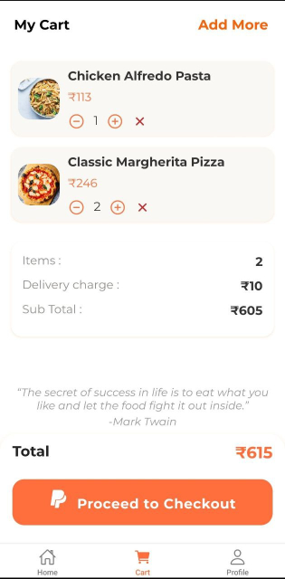

# Plateful – Food Delivery App
**Plateful** is a sample food delivery application built with React Native, using Zustand for state management and React Navigation for seamless navigation, including stack and bottom tab navigation. Users can browse delicious food, search menu items, view item details, manage their cart, and explore their profiles, all in a vibrant, modern UI.

## 🌟 Features
- **Beautiful Home Screen**: Browse a list of food items with images and prices.
- **Search Bar**: Instantly filter foods by name.
- **Food Detail Screen**: See detailed info, select quantity, and add to cart.
- **Persistent Cart**: View items, adjust quantity, remove, and see real-time pricing and bill breakdown.
- **Profile Screen**: Personalized profile with avatar editing, order history stub, and quick access to account features.
- **Bottom Tab Navigation**: Quick navigation between Home, Cart, and Profile.
- **State Management with Zustand**: Cart state is fast and reliable.
- **Responsive & Themed UI**: Orange/white theme, rounded cards, icons, and engaging visuals.

## 🖼️ UI Previews

## 🚀 How to Run

### 1. Clone the Repository

git clone <your-repo-url>
cd <your-project-folder>

### 2. Install Dependencies

npm install
or
yarn install

### 4. Run on Android/iOS
**For Android:**

npx react-native run-android

**For iOS:**

cd ios
pod install
cd ..
npx react-native run-ios
> Ensure you have an emulator or real device running.

### 5. App Usage

- Use the bottom tabs to switch between: Home, Cart, and Profile.
- Tap on a food card to view its details and add it to cart.
- See your cart, adjust quantities, and proceed to checkout.
- View or edit your profile and explore app options!

## 💡 Tech Stack

- **React Native**
- **Zustand** (state management)
- **Axios** (API requests)
- **React Navigation** (stack & bottom tab)
- **react-native-vector-icons** (UI icons)
- **TypeScript** (type safety)

